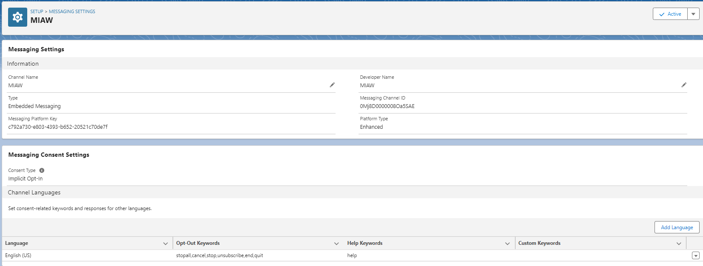
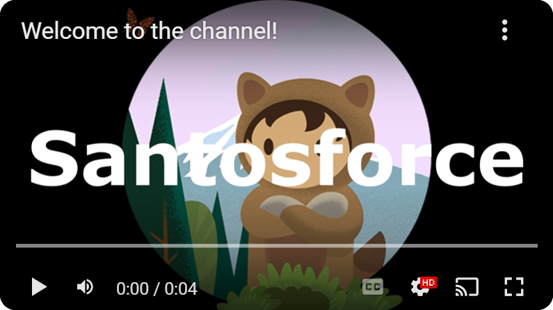
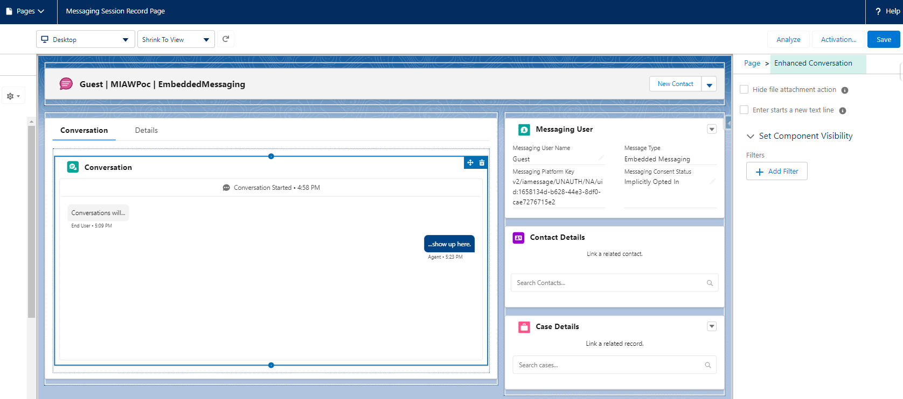
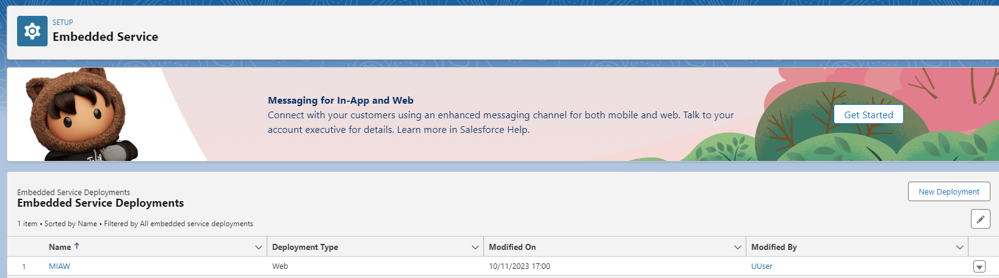
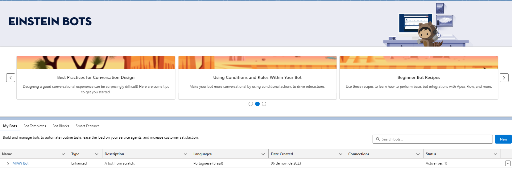

# Messaging for In-App and Web - MIAW

Here you'll see a scratch org working with a simple MIAW implementation.

### The official Salesforce Documentation

1. [What’s Service Cloud Messaging?](https://help.salesforce.com/s/articleView?id=sf.messaging_introduction.htm&type=5)
1. [What’s Messaging for In-App and Web?](https://help.salesforce.com/s/articleView?id=sf.reimagine_miaw.htm&type=5)
1. [Considerations when Replacing Chat with Messaging for In-App and Web](https://help.salesforce.com/s/articleView?id=sf.miaw_replacing_chat_considerations.htm&type=5)

### Are you a little bit lost?

Please, take a look on the **video demos** we have in the channel!

So, let's get down to business

## Scratch org creation

To make our lives easy, we can automate many things, putting the Salesforce CLI, and the bash scripts to run together!

    ./scripts/bash/createScratchOrg.sh tmpBot

### Deploy the necessary MIAW configuration

    sf project deploy start --ignore-conflicts --manifest manifest/package-Miaw.xml

### Manual steps

1. Activate the messaging setting created (MIAW);
1. Add the "Omni-channel" in the utility items, of the Service Console app;
1. Add your user in the "MIAW Queue" queue;
1. Add the presence status to the necessary profiles;
1. Set the new "Messaging Session Record Page" as the default one;
    * The reason to do that, is to use the "Enhanced Conversation" component;
    * Otherwise, the messages will not appear to the agents;
    

1. Grant the user access with the Messaging for In-App and Web User permission set (done by the Company page);
1. Create a new Embedded Service Deployments (MIAW):
    1. Click in new New deployment;
    1. As we'll test that in a visualforce page, as site you need to set "[YOUR SCRATCH]--c.scratch.vf.force.com";
        For example, if you have this URL environment:
        * https://**page-business-46872-dev-ed**.scratch.lightning.force.com

        You need to change from:
        * "[YOUR SCRATCH]--c.scratch.vf.force.com" 

        To:
        * **page-business-46872-dev-ed**--c.scratch.vf.force.com

    1. Apply the configurations you want to;
    1. Publish it;
    1. Click on Instal Code Snippet and Copy to Clipboard;
1. Configure the "MIAWInternalTest" visualforce page with the copied Code Snippet;
1. Update all CSP (Trusted URLs) configuration to reflect your brand new scratch org;
1. Edit the "MIAWToQueue" flow, to update the "serviceChannelId" of the environment (save as a new verions and activate it);
1. Create a service resource with your user;

### Check it out

1. Access the Service Console and the Omni Supervisor;
1. Let your user available;
1. Preview the "MIAWInternalTest" Visualforce Pages:
    * [YOUR SCRATCH]--c.scratch.vf.force.com/apex/MIAWInternalTest

    For example, if you have this URL environment:
    * https://**page-business-46872-dev-ed**.scratch.lightning.force.com

    You need to change from:
    * "[YOUR SCRATCH]--c.scratch.vf.force.com/apex/MIAWInternalTest" 

    To:
    * **page-business-46872-dev-ed**--c.scratch.vf.force.com/apex/MIAWInternalTest   

Now, you can chat with yourself... but, that is just the preparation to let your agents chat with customers!

## That's all (for now) folks

I know, now you already have many things here:

1. Service Cloud;
1. Messaging Seetings;
1. Omni-Channel;
1. Queues;
1. Omni flows to do the routing;
1. Embedded Service Deployment;
1. A visualforce page to test internaly;

But that is just the start point, coming soon we'll talk about the Einstein Bots, stay tuned...

<!-- 

To the bot

### Deploy the necessary MIAW configuration

    sf project deploy start --ignore-conflicts --manifest manifest/package-Miaw.xml

### Manual steps

1. Activate the messaging setting created (Bot Channel);
1. Add the "Omni-channel" in the utility items, of the Service Console app;
1. Add your user in the "MIAW Queue" queue;
1. Add the presence status to the necessary profiles;
1. Set the new "Messaging Session Record Page" as the default one;
    * The reason to do that, is to use the "Enhanced Conversation" component;
    * Otherwise, the messages will not appear to the agents;
    

1. Grant the user access with the Messaging for In-App and Web User permission set (done by the Company page);

#################################################################################################################
#
#    SO, YOU CAN READ THE INFORMATION BELOW HERE, BUT PLEASE, BEAR IN MIND THAT IS A WORK IN PROGRESS...
#    WITH THAT SAID, IS BETTER JUST IGNORE FOR NOW, AND SEE WHEN I HAVE THAT REALLY WORKING
#
#################################################################################################################
-->

<!-- 
### Add some data 

You can create some data on the BotOrder object using the code below.

<!-- SELECT Id, Name, Status__c, OrderDate__c, ContactId__c, Amount__c FROM BotOrder__c -- >

    List<String> orderListNumber = new List<String>{
        'O-00123456',
        'O-00123457',
        'O-00123458',
        'O-00123459',
        'O-00123460'
    };

    List<BotOrder__c> BotOrderList = new List<BotOrder__c>();

    Account newAccount = new Account(
        Name = 'First Account'
    );

    insert newAccount;

    Contact newContact = new Contact(
        FirstName = 'First',
        LastName = 'Contact',
        Email = 'charleston.santos.external@k2partnering.com', 
        AccountId = newAccount.Id
    );

    insert newContact;

    String contactId = String.valueOf(newContact.Id);

    system.debug('contactId ' + contactId);

    Integer intCount = 100;

    for (String orderMumber : orderListNumber){
        Date thisDate = Date.Today() + intCount;
        Decimal decAmount = 1000 + intCount;
        BotOrderList.add(
            new BotOrder__c (
                Name = orderMumber, 
                Status__c = 'New', 
                OrderDate__c = thisDate, 
                ContactId__c = contactId, 
                Amount__c = decAmount
            )
        );
    }

    insert BotOrderList;

---------------------------------------------------------------------------------------

### Create a digital experience

Yes, we'll not clear see that on the official cookbook, but you'll need that during the bot configuration, so... let's do that.

You can do that out of the box... or execute the CLI:

    Bash command:
    sf community create --name 'MIAW Bot' --template-name 'Microsite (LWR)' --url-path-prefix miawbot --description 'The MIAW bot community'

    Windows command:
    sf community create --name "MIAW Bot" --template-name "Microsite (LWR)" --url-path-prefix miawbot --description "The MIAW bot community"

After that, you'll still needing apply the necessary configurations like activation, publishing, etc, but that is it for now...

And when the org and digital experience have been created, deploy the thing done before...

    sf project deploy start --ignore-conflicts --manifest manifest/package.xml 

## My MIAW cookbook

Based on the official salesforce [Einstein Bots Developer Cookbook](https://resources.docs.salesforce.com/latest/latest/en-us/sfdc/pdf/bot_cookbook.pdf), I have created this one.

But here, besides we have the bot feature, I'm also will show you [What’s Messaging for In-App and Web](https://help.salesforce.com/s/articleView?id=sf.reimagine_miaw.htm&type=5) and the necessary things, to have that working.

Let's start understanding were I got this ideas? Sure, from the free official salesforce material!
* [Digital Engagement](https://help.salesforce.com/s/articleView?id=sf.sales_core_digital_engagment.htm&type=5) is the big picture;

You need to understand a little bit about [Messaging in Service Cloud](https://help.salesforce.com/s/articleView?id=sf.livemessage_intro.htm&type=5) and what would be the "Messaging for In-App and Web" aka [MIAW](https://help.salesforce.com/s/articleView?id=sf.reimagine_miaw.htm&type=5), and mainly [how to Set Up Messaging for In-App and Web](https://help.salesforce.com/s/articleView?id=sf.miaw_setup_stages.htm&type=5)

### User Access

1. So, [Give Users Access to Messaging for In-App and Web](https://help.salesforce.com/s/articleView?language=en_US&id=sf.miaw_prepare_users.htm&type=5)

    After that, assign the permission to the user if you are using a CLI approach

    sfdx force:user:permset:assign --perm-set-name MIAWPermissionSet --target-org tmpBot
1. Create a the following [Presence Status for messaging](https://help.salesforce.com/s/articleView?id=sf.service_presence_create_presence_status.htm&type=5clear)
    1. Chat
    1. Messaging
    1. Chat & Messaging
    1. Busy
1. Create a permission set for your messaging agents (CMIAW Agents Permission Set)
    1. Select None from the License dropdown menu;
    1. Click the name of your permission set from the related list, and select App Permissions.
    1. Click Edit, and check Messaging for In-App and Web Agent;
    1. Set the **Service Presence Statuses Access**;
    1. Set the Messaging Sessions object the appropriate access;
    1. Set the Messaging Users object the appropriate access;
    1. Save your changes whenever is needed;

    After that, assign the permission to the user if you are using a CLI approach

    sfdx force:user:permset:assign --perm-set-name MIAWAgentsPermissionSet --target-org tmpBotTwo

### Org preparation

Many features works together, so you need to [Prepare a Salesforce Org for Messaging for In-App and Web](https://help.salesforce.com/s/articleView?id=sf.miaw_prepare_org_1.htm&type=5)

1. [Enable Omni-Channel](https://help.salesforce.com/s/articleView?id=sf.omnichannel_enable.htm&type=5)
1. [Create the Service Channel for messaging](https://help.salesforce.com/s/articleView?id=sf.service_presence_create_service_channel.htm&type=5)
1. Create the the **MIAW Queue** (and a **Fallback Queue**) following this [Queues guidance](https://help.salesforce.com/s/articleView?id=sf.setting_up_queues.htm&type=5)
1. Create an Omni Flow, but if you set up your Pre-Chat Form, return to this flow to map pre-chat fields to your messaging channel.
    1. From Setup, in the Quick Find box, enter Flows, and select Flows.
    1. Create a New Flow.
    1. In the All + Templates tab, select Omni-Channel Flow.
    1. From the Manager tab, create a New Resource.
    1. Select Variable as your Resource Type.
    1. For the API Name, enter recordId. For the Data Type, specify text.
    1. Check Available for input, and then click Done.
    1. From the Elements tab, select a Route Work action in your flow.
    1. Name the New Action. Use recordId variable as the input value. Select Messaging for the Service Channel.
    1. Specify Queue, Agent, Bot, or Skills as the Route To value.
        1. If you select Queue, use the Queue ID for the queue where you want to direct the work.
        1. If you select Agent, add the agent’s name via the Agent ID field.
        1. If you select Bot, search for the bot name.
        1. If you select Skills, add the Skill Requirement List.

        BOT BOT BOT BOT BOT BOT BOT BOT BOT BOT BOT BOT BOT BOT BOT BOT BOT

    1. Click Done.
    1. Save and Activate your flow.
1. Add a Messaging Channel, but bear in mind that you don't need to toggle the **Messaging** button to on. The Messaging toggle is for Facebook, WhatsApp, and SMS messaging only.
    1. Set the flow created on the previous steps as the "Flow Definition";
    1. Check the "Show estimated wait time" option;
    1. Set "5" as "Minutes to Timeout";
    1. Save and activate this channel.
1. Prepare the Messaging Session Layout
    1. From Setup, in the Quick Find box, enter Lightning App Builder, and select Lightning App Builder.
    1. To create a Lightning page, select New.
    1. Select the page type Record Page.
    1. Name the page, and then select Messaging Session as the Object.
    1. On the next screen, Select CLONE SALESFORCE DEFAULT PAGE and finish.
    1. When you’re inside the app builder, add the Enhanced Conversation component to the page.
    1. Activate the page.

### Einstein Bot configuration

So, now, let's create the Einstein Bot.
This activation add the **sfdc.chatbot.service.permset** permission set  to your org, and here you can grant access to Apex classes, objects and enable access to flows from the Run Flows checkbox in the System Permissions section.

1. From Setup, use the Quick Find box to find Einstein Bots. 
1. Enable Einstein Bots.
1. Click New on the Einstein Bots setup page (let's create the **MIAW Bot**).
1. After filling up other information, when you arrives at "Route bot conversations with Omni-Channel Flow", add the flow you have created before;
1. Clicking on **Proceed** button, the setup will create or adjust:
    * [Custom Dialogs](https://help.salesforce.com/s/articleView?id=sf.bots_service_dialog_about.htm&type=5) for the Welcome message and Main Menu
    * [System Dialogs](https://help.salesforce.com/s/articleView?id=sf.bots_service_system_bot_dialog.htm&type=5) for commonly-used actions like agent escalations
    * Bot Analytics to help measure performance
    * Omni-Channel Flow for routing conversations
1. Click **Finish**.
1. To activate your bot, click Activate.

<!-- We'll not activate this bot now, but we'll get back here later... -- >

### Routing to the Bot

At this point, the setup have created another "Route to MIAW Bot" flow (following the name we have used in this cookbook), that will route the arriving chats to this bot.

But any way, you need to change this flow, adding a real queue there and activating it.
In this example, I did the same done on the "MIAW to Queue" flow, read the queue name from the configuration.

### Preview the bot

To preview the bot from within the Bot Builder, add an [Embedded Chat](https://help.salesforce.com/s/articleView?id=sf.snapins_chat_setup.htm&type=5) deployment.

1. Go to [Embedded Service Deployments](https://help.salesforce.com/s/articleView?id=sf.snapins_create_deployment.htm&type=5);
1. Clicks on "New deployment"
1. Select "Embedded Chat" and "Next"
1. Name it as "Bot Preview" and select the digital experience created before and save;

### Grab user information with apex

We are using this simple "MessagingContactData" apex class, that you need to grant the bot access through the "Chatbot" permission set to use.

1. Create a new bot dialog named "Messaging Initialization"
1. Add an action at the top of the flow using the Apex action type;
1. For the input, use the built-in variable [Context] End User Id.
1. Create a new variable named MessagingContact;
1. Return to the "Welcome" dialog and create a Call Dialog rule;
1. Add a rule to the top of the “Welcome” dialog flow.
1. Add Condition to the rule. 
    1. Configure the condition so that MessagingContact is the variable name and that the operator is Is Not Set. 
    1. Set the Rule Action to CallDialog and the Dialog Name to MessagingInitialization. 

### Asking things to the bot

To question things....

You can create some data on the BotOrder object using the code below

<!-- SELECT Id, Name, Status__c, OrderDate__c, ContactId__c, Amount__c FROM BotOrder__c -- >

Let's query the data using a "OrderNumberString" (regular expression: \bO\-\d{8}\b) entity to understand the order pattern we have created above, and the "OrderNumber" variable.

Create a “Order Status”  question dialog, and add a "Question" on the main body, setting the "OrderNumberString" as the "Expected response format" and the "OrderNumber" as the "Save Answer to Variable".

After that, you can add a "response message" to the "Order Status" dialog.

The end point is the same you see under "Chat Settings", but without the protocol.

Optimize Bot Flow with Embedded Chat

[Glossary](https://help.salesforce.com/s/articleView?id=sf.miaw_glossary.htm&type=5)

[Set Up Messaging for In-App and Web](https://help.salesforce.com/s/articleView?id=sf.miaw_setup_stages.htm&type=5)
[Messaging for In-App developer guide](https://developer.salesforce.com/docs/service/messaging-in-app/overview)
[Configure a Messaging for In-App Deployment](https://help.salesforce.com/s/articleView?id=sf.miaw_deployment_mobile.htm&type=5)

[Get Started with Messaging for Web](https://developer.salesforce.com/docs/service/messaging-web/guide/introduction.html)

[Get Started with Einstein Bots API](https://developer.salesforce.com/docs/service/einstein-bot-api/guide/prerequisites.html)
    [Introducing the Einstein Bots Platform API](https://developer.salesforce.com/blogs/2022/05/introducing-the-einstein-bots-platform-api)

[Create Customer Flows for Messaging for In-App and Web](https://help.salesforce.com/s/articleView?id=sf.miaw_custom_field_example.htm&type=5)
[Persist Pre-Chat Inputs Across Messaging Sessions](https://help.salesforce.com/s/articleView?id=sf.miaw_handle_sessions.htm&type=5)
[Map Pre-Chat Values in Omni-Channel Flow](https://help.salesforce.com/s/articleView?id=sf.miaw_map_messaging_2.htm&type=5)
[Configure a Messaging for Web Deployment in an Experience Builder or Commerce Cloud site](https://help.salesforce.com/s/articleView?id=sf.miaw_deployment_experience_builder.htm&type=5)

[Add Flexibility and Power with Messaging for In-App and Web](https://help.salesforce.com/s/articleView?id=sf.miaw_intro_landing.htm&type=5)

1. 
1. 
1. 
1. 
1. 
1. 
1. 
1. 
1. 
1. 
1. 
1. 

-----------------------------------------------------------------

1. But actually, we'll start configuring [Messaging](https://help.salesforce.com/s/articleView?id=sf.livemessage_enable.htm&type=5) settings:
    1. [Prepare for WhatsApp, Facebook Messenger, and SMS](https://help.salesforce.com/s/articleView?id=sf.messaging_prepare.htm&type=5) is the same preparation you need to other MIAW features;

			
			
				
		Set Up Automated Notifications in Service Cloud Messaging
			https://help.salesforce.com/s/articleView?id=sf.livemessage_automatic_message_notifications.htm&type=5
		Message with Customers in the Service Console
			https://help.salesforce.com/s/articleView?id=sf.livemessage_agent.htm&type=5

	Omni-Channel
		Set Up Omni-Channel
			https://help.salesforce.com/s/articleView?id=sf.service_presence_intro.htm&type=5
	Web chat
		Create a Basic Chat Implementation
			https://help.salesforce.com/s/articleView?id=sf.live_agent_set_up_basic_implementation.htm&type=5
		Set Up Your Embedded Chat Window
			https://help.salesforce.com/s/articleView?id=sf.snapins_chat_setup.htm&type=5
	Einstein Bots
		https://help.salesforce.com/s/articleView?id=sf.bots_service_intro.htm&type=5

 -->